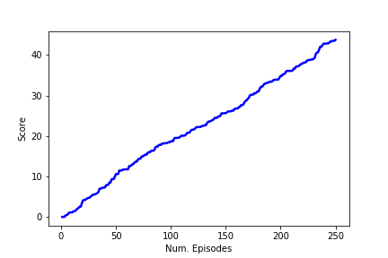
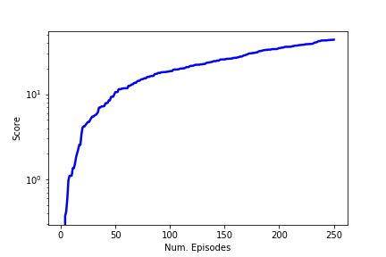

# Report 

## Problem Statement
Reinforcement learning (RL) aims to learn a policy for an agent such that it behaves optimally
according to a reward function. In this environment, a double-jointed arm can move to target locations. A reward of +0.1 is provided for each step that the agent's hand is in the goal location. Thus, the goal of your agent is to maintain its position at the target location for as many time steps as possible.

The observation space consists of 33 variables corresponding to position, rotation, velocity, and angular velocities of the arm. Each action is a vector with four numbers, corresponding to torque applicable to two joints. Every entry in the action vector must be a number between -1 and 1.

## Methodology
This work implements the DDPG algorithm (Deep Deterministic Policy Gradients) to the 20 agents Reacher environment, as described in [_Continuous Control with Deep Reinforcement Learning_][ddpg-paper] (Lillicrap et al). 
- [ddpg-paper]: https://arxiv.org/pdf/1509.02971.pdf

For each time step and agent the Agent acts upon the state utilising a shared (at class level) `replay_buffer`, `actor_local`, `actor_target`, `actor_optimizer`, `critic_local`, `criticl_target` and `critic_optimizer` networks.

## Hyperparameters 
### DDPG Hyperparameters
- num_episodes (int): maximum number of training episodes
- max_t (int): maximum number of timesteps per episode
- num_agents: number of agents in the environment

Where
`num_episodes=250`, `max_t=450`

### DDPG Agent Hyperparameters

- BUFFER_SIZE (int): replay buffer size
- BATCH_SIZ (int): mini batch size
- GAMMA (float): discount factor
- TAU (float): for soft update of target parameters
- LR_ACTOR (float): learning rate for optimizer
- LR_CRITIC (float): learning rate for optimizer
- L2_WEIGHT_DECAY (float): L2 weight decay

Where 
`BUFFER_SIZE = int(1e6)`, `BATCH_SIZE = 64`, `GAMMA = 0.99`, `TAU = 1e-3`, `LR_ACTOR = 1e-4`, `LR_CRITIC = 3e-4`, `L2_WEIGHT_DECAY = 0.0001`

## Results 
Enviroment solved in @ i_episode=224, w/ avg_score=30.14

The agents were able to solve task in 224 episodes with an average score of 30.14 as well as final average score of 34.73 after 250 episodes.

## Future work
We found that the DRL is not plug and play like other DL frameworks.

To find the optimal set of hyperparameter we can leverage dertivative-free optimiation schemes. The hyperparameter optimization is a blackbox optimizaiton fuction. In order to find the hyperparameters of an unknown function and improving results tunning the networks scructures (adding layers or units per layers, ...), we can use [ Delaunay-based Derivative-free Optimization via Global Surrogates ][dogs] or [ deltaDOGS ][alimo-2017] (Alimo et al). 

Furtheremore, the implementation of Proximal Policy Optimization (PPO) and Distributed Distributional Deterministic Policy Gradients (D4PG) methods could be explored to achieve better performance results. 

[dogs]: https://github.com/deltadogs
[alimo-2017]: http://fccr.ucsd.edu/pubs/abmb17.pdf

## References
- <https://sergioskar.github.io/Actor_critics/>
- <https://arxiv.org/pdf/1611.02247.pdf> 
- <https://arxiv.org/pdf/1509.02971.pdf>
- <https://github.com/udacity/deep-reinforcement-learning/blob/master/ddpg-bipedal/DDPG.ipynb>
- <http://fccr.ucsd.edu/pubs/abmb17.pdf>
- <https://github.com/deltadogs>
